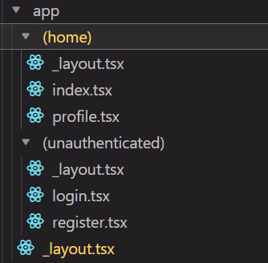

# What I learned

- [What I learned](#what-i-learned)
  - [nativewind](#nativewind)
    - [Complete dark mode guide](#complete-dark-mode-guide)
  - [Expo Router](#expo-router)
    - [Setup](#setup)
    - [Pages](#pages)
    - [Navigation](#navigation)
      - [Links](#links)
      - [Programmatic](#programmatic)
    - [Layouts](#layouts)
    - [Dynamic navigation](#dynamic-navigation)
    - [Themes](#themes)
    - [Error Boundaries](#error-boundaries)
    - [Search params](#search-params)
    - [Redirecting](#redirecting)
    - [Status bar](#status-bar)
    - [Navigation layouts](#navigation-layouts)
      - [Stack navigation](#stack-navigation)
      - [Tab navigation](#tab-navigation)
        - [Tab bar icons](#tab-bar-icons)
      - [Drawer navigation](#drawer-navigation)
      - [Modal navigation](#modal-navigation)
    - [Hooks](#hooks)
      - [`useFocusEffect()`](#usefocuseffect)
      - [`useNavigation()`](#usenavigation)
      - [`usePathName()`](#usepathname)
  - [Apperance elements](#apperance-elements)
    - [Splash Screen](#splash-screen)
    - [Fonts](#fonts)
    - [Expo Image](#expo-image)
  - [Environment variables](#environment-variables)
  - [Clerk auth](#clerk-auth)
    - [Setup](#setup-1)
    - [Auth flow](#auth-flow)
    - [Login Flow](#login-flow)
    - [SignUp flow](#signup-flow)
    - [Google OAuth](#google-oauth)
    - [Logout](#logout)
    - [Resetting passwords](#resetting-passwords)
    - [Updating user data](#updating-user-data)
    - [Auth Components](#auth-components)
      - [`<SignedIn />` and `<SignedOut />`](#signedin--and-signedout-)
    - [Hooks](#hooks-1)
  - [Other](#other)
    - [Icon Button](#icon-button)

## nativewind

Follow these steps:

1. Install all dependencies
2. Make your tailwind config into this:

```js
/** @type {import('tailwindcss').Config} */
module.exports = {
  content: ["./app/**/*.{js,jsx,ts,tsx}", "./components/**/*.{js,jsx,ts,tsx}"],
  theme: {
    extend: {},
  },
  plugins: [],
};
```

3. Make your babel config into this or just add the nativewind babel plugin.

```js
module.exports = function (api) {
  api.cache(true);
  return {
    presets: ["babel-preset-expo"],
    plugins: [
      // Required for expo-router
      "expo-router/babel",
      "nativewind/babel",
    ],
  };
};
```

4. Install a specific version of tailwind with `npm i --dev tailwindcss@3.3.2`

### Complete dark mode guide

You can use the `useColorScheme()` hook from nativewind to easily access and change color schemes.

```tsx
import { useColorScheme } from "nativewind";

export default function App() {
  const { colorScheme, toggleColorScheme, setColorScheme } = useColorScheme();
}
```

Based on the color scheme, all `dark:` styles in tailwind are applied automatically.

- `colorScheme` : the current color scheme, either "light" or "dark"
- `toggleColorScheme()` : toggles the color scheme
- `setColorScheme()` : sets the color scheme

If you want to save dark mode preferences, you can use async storage along with context, like so:

```tsx
type ColorScheme = "light" | "dark";

interface IDarkModeContext {
  isDarkMode: boolean;
  toggleMode: () => void;
}

export const DarkModeContext = createContext<IDarkModeContext | null>(null);

export const useDarkModeContext = () => {
  const context = useContext(DarkModeContext);
  if (!context) {
    throw new Error(
      "useDarkModeContext has to be used within <DarkModeContext.Provider>"
    );
  }
  return context;
};

export const DarkModeProvider = ({ children }: { children: ReactNode }) => {
  const { colorScheme, setColorScheme, toggleColorScheme } = useColorScheme();
  const [isDarkMode, setIsDarkMode] = useState<boolean>(colorScheme === "dark");

  const toggleMode = async () => {
    toggleColorScheme();
    await AsyncStorage.setItem("colorScheme", isDarkMode ? "light" : "dark");
    setIsDarkMode((prev) => !prev);
  };

  useEffect(() => {
    async function fetchStore() {
      const stored = await AsyncStorage.getItem("colorScheme");
      if (stored) {
        setColorScheme(stored as ColorScheme);
        setIsDarkMode(stored === "dark");
      }
    }

    fetchStore();
  }, []);

  return (
    <DarkModeContext.Provider
      value={{
        isDarkMode,
        toggleMode,
      }}
    >
      {children}
    </DarkModeContext.Provider>
  );
};
```

Anywhere you want to have conditional logic based on the dark mode, use `isDarkMode`.

Anytime you want to change the color scheme, use `toggleMode()`

## Expo Router

### Setup

1. Create a typescript navigation project with `npx create-expo-app --template`. This should install everything for you automatically

### Pages

Pages are based on astro file routing systems with some caveats. Here are some the features you have with this routing system:

- `index.js` and `index.ts` kind of function like how a page.js works, but you can use other file names to get the full route.
- You can use dynamic route names with `[]` syntax
- You can have route grouping like NextJS with the `()` syntax.
- You can have catch-all routes with the `[...]` syntax.

All pages must export default a react component, but the name doesn't matter.

- `app/home.js` matches /home
- `app/settings/index.js` matches /settings
- `app/[user].js` matches dynamic paths like /expo or /evanbacon
- `app/[user]/index.js` also matches dynamic paths like /expo or /evanbacon
- `app/blog/[...rest].js` : a catch-all that matches /blog, /blog/abc, /blog/abc/def, and so on.

### Navigation

#### Links

Just like in NextJS, you can use the `<Link />` component to link to different pages.

Simply import from `import { Link } from "expo-router";` and then use the `href` prop to link to a page route.

```tsx
import { View } from "react-native";

import { Link } from "expo-router";

export default function Page() {
  return (
    <View>
      <Link href="/about">About</Link>
      <Link href="/user/bacon">View user</Link>
    </View>
  );
}
```

Here are some important Link props:

- `href` : the route to navigate to
- `replace` : if true, replaces the current history entry instead of adding a new one, preventing going back to the current page

#### Programmatic

You can use the `router` object from expo router to programmatically navigate to a page, just like in nextJS.

```tsx
import { router } from "expo-router";

export function logout() {
  router.replace("/login");
}
```

Here are some useful router methods:

- `router.push(route: string)` : Navigates to the page.
- `router.replace(route: string)` : Navigates to the page but replaces existing history, preventing going back
- `router.back()` : Navigates back in history
- `router.canGoBack()` : Returns a boolean if you can go back in history
- `router.setParams(object)` : Sets the search query params for the current page. Only useful when combined with the `useLocalSearchParams()` hook.

### Layouts

Just like in NextJS, layouts nest each pages and cascade down. You can have one layout per directory, and you must have one root layout.

Layouts use the `<Slot />` component like in astro to nest children.

```javascript
import { Slot } from "expo-router";

export default function HomeLayout() {
  return <Slot />;
}
```

### Dynamic navigation

1. Create and register a dynamic screen using the `[]` syntax.

```tsx
const Example = () => {
  return (
    <Stack>
      <Stack.Screen name="job-details/[jobId]" />
    </Stack>
  );
};
```

2. Get the route params from the `useLocalSearchParams()` hook, which returns an object of all the dynamic route param values for that route.

```tsx
// job-details/[jobId].tsx
export default function JobDetails() {
  const params: { jobId: string } = useLocalSearchParams();
}
```

### Themes

```javascript
import {
  ThemeProvider,
  DarkTheme,
  DefaultTheme,
  useTheme,
} from "@react-navigation/native";

import { Slot } from "expo-router";

// create a theme by spreading across your stuff
const MyTheme = {
  ...DarkTheme,
  colors: {
    ...DarkTheme.colors,
    primary: "rgb(255, 45, 85)",
  },
};

export default function RootLayout() {
  return (
    <ThemeProvider value={DarkTheme}>
      <Slot />
    </ThemeProvider>
  );
}
```

You can then use the `useTheme()` hook to access your theme in components.

```tsx
const { colors } = useTheme();
```

```tsx
import * as React from "react";
import { TouchableOpacity, Text } from "react-native";
import { useTheme } from "@react-navigation/native";

// Black background and white text in light theme, inverted on dark theme
function MyButton() {
  const { colors } = useTheme();

  return (
    <TouchableOpacity style={{ backgroundColor: colors.card }}>
      <Text style={{ color: colors.text }}>Button!</Text>
    </TouchableOpacity>
  );
}
```

### Error Boundaries

By exporting an `ErrorBoundary` component from your pages, you create a react error boundary component that will catch errors and render a UI for that error:

```tsx
import { View, Text } from "react-native";

export function ErrorBoundary(props: ErrorBoundaryProps) {
  return (
    <View>
      <Text>{props.error.message}</Text>
      <Text onPress={props.retry}>Try Again?</Text>
    </View>
  );
}
export default function Page() {
  // page code here
}
```

Here are the props that are passed in to an error boundary component:

- `error` : the error that was thrown, of type `Error`
- `retry()` : an async function that retries rendering the component

### Search params

Search params are a way of sharing data between screens.

1. Set the search params with `router.setParams({})`, passing an object of all the search params you want to pass.
2. Use the `useLocalSearchParams()` hook to access the search params in a page.

```tsx
import { useLocalSearchParams, router } from "expo-router";
import React from "react";
import { TextInput, View } from "react-native";

export default function Page() {
  const params = useLocalSearchParams<{ q?: string }>();
  const [search, setSearch] = React.useState(params.q);

  return (
    <TextInput
      value={search}
      onChangeText={(search) => {
        setSearch(search);
        router.setParams({ q: search });
      }}
    />
  );
}
```

### Redirecting

We can automatically redirect users based on conditions by rendering the `<Redirect />` component.

```tsx
import { View, Text } from "react-native";
import { Redirect } from "expo-router";

export default function Page() {
  const { user } = useAuth();

  if (!user) {
    return <Redirect href="/login" />;
  }

  return (
    <View>
      <Text>Welcome Back!</Text>
    </View>
  );
}
```

The `<Redirect>` component takes in an `href` string prop, which is the route to redirect to.

### Status bar

This is how we'll handle statusbar styling:

```tsx
<Stack
  screenOptions={{
    // "dark" refers to color of statusbar items as gray, so you want this on light mode
    // "light" renders statusbar items as white, so you want this on dark mode
    statusBarStyle: !isDarkMode ? "dark" : "light",
    statusBarTranslucent: true,
  }}
>
```

- `statusBarTranslucent` : makes the status bar translucent. This should be set to true
- `statusBarStyle` : determines the color scheme of the status bar. `"dark"` is where the statusbar items have a gray text color, and `"light"` is where the statusbar items have a white text color.
  - So whenever we're in dark mode, we want to set statusbar style to `"light"`, and whenever we're in light mode, we want to set it to `"dark"`.

### Navigation layouts

We have an easier way of using native stack navigation, drawers, and tabs.

By default, all files in the `app` router are registered as routes, so Screen components are only used for configuring individual screen options like titles and header style.

#### Stack navigation

This is the basic use of creating and setting up a stack:

```tsx
import { Stack } from "expo-router/stack";

export default function Layout() {
  return <Stack />;
}
```

There are two ways to configure stack screens

- Nest `<Stack.Screen>` components within the `<Stack />` navigator statically
- In the pages that your layouts nest, Render the `<Stack.Screen />` component, which allows you to change the look of the screen dynamically form the page itself instead of the layout.

> **Static way**

The `name` prop on the `<Stack.Screen />` component should be set to the file or folder name you're navigating to. This is automatically find the pages to render behind the scenes.

#### Tab navigation

Tab navigation is rendered within a `<Tabs>` container and renders individual screens with `<Tab.Screen>` components.

```tsx
import { Tabs } from "expo-router/tabs";
export default function AppLayout() {
  return (
    <Tabs>
      <Tabs.Screen
        // Name of the route to hide.
        name="index"
        options={{
          // This tab will no longer show up in the tab bar.
          href: null,
        }}
      />
    </Tabs>
  );
}
```

Here are the important props you can set on each screen:

- `name` : the name of the route, based on file or folder
- `options` : the list of screen options
  - `href` : the route to navigate to. If `null`, this tab button won't show up.

##### Tab bar icons

You can type tab bar icons with expo vector icons

```javascript
import FontAwesome from "@expo/vector-icons/FontAwesome";

function TabBarIcon(props: {
  name: React.ComponentProps<typeof FontAwesome>["name"],
  color: string,
}) {
  return <FontAwesome size={28} {...props} />;
}
```

```tsx
function TabBarIcon(props: {
  name: React.ComponentProps<typeof FontAwesome>["name"];
  color: string;
}) {
  return <FontAwesome size={28} {...props} />;
}

export default function TabLayout() {
  const colorScheme = useColorScheme();

  return (
    <Tabs
      screenOptions={{
        tabBarActiveTintColor: Colors[colorScheme ?? "light"].tint,
      }}
    >
      <Tabs.Screen
        name="index"
        options={{
          title: "Tab One",
          tabBarIcon: ({ color }) => <TabBarIcon name="code" color={color} />,
          headerRight: () => (
            <Link href="/modal" asChild>
              <Pressable>
                {({ pressed }) => (
                  <FontAwesome
                    name="info-circle"
                    size={25}
                    color={Colors[colorScheme ?? "light"].text}
                    style={{ marginRight: 15, opacity: pressed ? 0.5 : 1 }}
                  />
                )}
              </Pressable>
            </Link>
          ),
        }}
      />
      <Tabs.Screen
        name="two"
        options={{
          title: "Tab Two",
          tabBarIcon: ({ color }) => <TabBarIcon name="code" color={color} />,
        }}
      />
    </Tabs>
  );
}
```

#### Drawer navigation

#### Modal navigation

Here is how we make a transparent modal:

```tsx
<Stack.Screen
  name="profile"
  options={{
    presentation: "transparentModal",
    headerShown: false,
  }}
/>
```

The `presentation` option determines how the screen is presented, with these possible values:

- `modal` : provides a modal-like native experience on IOS, where you can dismiss the modal by swiping down.
- `transparentModal` : provides a modal that overlays the current screen, so if you reduce the opacity of the modal screen, you'll be able to see the screen below.

For android, we'll want to use the `transparentModal` option, and then make the background color of our modal screen translucent by giving it an rgba value.

### Hooks

#### `useFocusEffect()`

The `useFocusEffect()` hook allows you to run code when the page is focused. It takes in a callback, and executes that callback whenever the page gets focus.

```tsx
import { useFocusEffect } from 'expo-router';

export default function Route() {
  useFocusEffect(() => {
    console.log('Hello')
  })

  return </>
}
```

#### `useNavigation()`

Used to access the `navigation` object from react navigation, allowing you to do other stuff like opening drawers.

```tsx
import { useNavigation } from "expo-router";

export default function Route() {
  const navigation = useNavigation();
  return (
    <View>
      <Text
        onPress={() => {
          navigation.openDrawer();
        }}
      >
        Open Drawer
      </Text>
    </View>
  );
}
```

#### `usePathName()`

```tsx
const pathname = usePathname();
```

Returns the pathname of the current route, stripping out the search params.

## Apperance elements

### Splash Screen

The `SplashScreen` class extends the default class from expo splashscreen, and we can now import it from `expo-router`.

The basic idea is we want to show our splash screen until our fonts and assets are loaded, and then hide the splash screen when the app is ready to show.

Here are the steps:

1. Show the splash screen and force it to stay visible

   ```tsx
   import { SplashScreen } from "expo-router";
   SplashScreen.preventAutoHideAsync();
   ```

2. Do not render any content when the app is not ready to show:

   ```tsx
   if (!fontsLoaded) {
     return null;
   }
   ```

3. Hide the splash screen when the app is ready to show:

   ```tsx
   useEffect(() => {
     if (fontsLoaded) {
       SplashScreen.hideAsync();
     }
   }, [fontsLoaded]);
   ```

Here is how it all looks together:

```tsx
import { Text, View } from "react-native";
import { SplashScreen, Slot } from "expo-router";

import { useFonts, Inter_500Medium } from "@expo-google-fonts/inter";

SplashScreen.preventAutoHideAsync();

export default function Layout() {
  const [fontsLoaded, fontError] = useFonts({
    Inter_500Medium,
  });

  useEffect(() => {
    if (fontsLoaded || fontError) {
      // Hide the splash screen after the fonts have loaded (or an error was returned) and the UI is ready.
      SplashScreen.hideAsync();
    }
  }, [fontsLoaded, fontError]);

  // Prevent rendering until the font has loaded or an error was returned
  if (!fontsLoaded && !fontError) {
    return null;
  }

  // Render the children routes now that all the assets are loaded.
  return <Slot />;
}
```

- `SplashScreen.preventAutoHideAsync()` : prevents hiding the splash screen, forces it to stay visible. We can then programmatically close it later, when our app is ready to show.
- `SplashScreen.hideAsync()` : hides the splash screen. We can call this when our app is ready to show.

### Fonts

### Expo Image

Expo Image is like NextJS `<Image />` component, optimized for mobile.

1. Install with `npx expo install expo-image`
2. Import like `import { Image } from 'expo-image';`

Here are some props you should use on the image component:

- `source` : the image source
- `alt` : the image alt text
- `contentFit` : acts like the `object-fit` property from CSS. Default is set to "cover", but you can also set it to these other values:
  - `contain` : scales the image to fit inside the container, preserving the image's aspect ratio
  - `cover` : scales the image to cover the container, preserving the image's aspect ratio
  - `fill` : stretches the image to fill the container width and height, ignoring the aspect ratio
- `placeholder` : a placeholder image to show while the image is loading
- `transition` : the duration of the cross-fade transition between the placeholder and real image, in milliseconds

```javascript
import { Image } from "expo-image";
import { StyleSheet, View } from "react-native";

const blurhash =
  "|rF?hV%2WCj[ayj[a|j[az_NaeWBj@ayfRayfQfQM{M|azj[azf6fQfQfQIpWXofj[ayj[j[fQayWCoeoeaya}j[ayfQa{oLj?j[WVj[ayayj[fQoff7azayj[ayj[j[ayofayayayj[fQj[ayayj[ayfjj[j[ayjuayj[";

export default function App() {
  return (
    <View>
      <Image
        source="https://picsum.photos/seed/696/3000/2000"
        placeholder={blurhash}
        contentFit="cover"
        transition={1000}
      />
    </View>
  );
}
```

For the `placeholder`, you can use something called a **blur hash**, which is a string you can provide to the placheolder prop and it renders a blurred image source while the real image is loading. Here are the steps to do such a thing:

1. Go to https://blurha.sh/ and generate a blur hash for an image
2. On the `<Image />` component, use the `placeholder` prop and use the blur hash value for it.

## Environment variables

You can now access environment variables without any setup by prefixing them with the `EXPO_PUBLIC` identifier, allowing you to access them on `process.env`.

However, these env variables are not encrypted, and they are on the client side. They're not suitable for having actual secrets.

## Clerk auth

### Setup

1. `npm install @clerk/clerk-expo` to install clerk
2. Add your clerk publishable key to your environment variables.

```bash
EXPO_PUBLIC_CLERK_PUBLISHABLE_KEY=clerk.public.abc123
```

3. Add the clerk provider to your app

```javascript
import { ClerkProvider } from "@clerk/clerk-expo";

function RootLayoutNav() {
  return (
    <ClerkProvider
      publishableKey={process.env.EXPO_PUBLIC_CLERK_PUBLISHABLE_KEY || ""}
    >
      <NavigationStack />
    </ClerkProvider>
  );
}
```

4. Allow for caching auth state by creating a JWT token cache for clerk. First install secure store with `expo install expo-secure-store`
5. Create a token cache method

```javascript
import * as SecureStore from "expo-secure-store";

const tokenCache = {
  async getToken(key: string) {
    try {
      return SecureStore.getItemAsync(key);
    } catch (err) {
      return null;
    }
  },
  async saveToken(key: string, value: string) {
    try {
      return SecureStore.setItemAsync(key, value);
    } catch (err) {
      return;
    }
  },
};
```

6. Pass the token cache to the clerk provider

```javascript
<ClerkProvider
  publishableKey={process.env.EXPO_PUBLIC_CLERK_PUBLISHABLE_KEY || ""}
  tokenCache={tokenCache}
>
  <NavigationStack />
</ClerkProvider>
```

### Auth flow

We have to listen for the auth state on clerk so we can programmatically navigate depending on the auth state. We will use a `useEffect()` for this.

We'll create two route groups for our project: `(home)` for authenticated users and `(unauthenticated)` for unauthenticated users.

In each route group, we'll have a layout that has their own stack navigation, instantiating the screens for that stack.



1. Get auth state from the `useUser()` hook from clerk expo. Also get the router
   - `user` : the user object
   - `isLoaded` : boolean, where true if the auth state is loaded
   - `isSignedIn` : boolean, where true if the user is signed in

```tsx
const { isLoaded, isSignedIn, user } = useUser();
const router = useRouter();
```

1. Do not do anything when the user auth state is not ready, meaning when `isLoaded` is false, do not navigate.
2. If the user is signed in, navigate to the home page. If the user is not signed in, navigate to the login page.

```javascript
useEffect(() => {
  if (!isLoaded) return;
  if (isSignedIn) {
    router.replace("/");
  } else {
    router.replace("/login");
  }
}, [isSignedIn]);
```

4. Render the `<Slot />` component to render the children routes. We'll take care of the navigation in the children layout components.

```tsx
function NavigationStack() {
  const { isLoaded, isSignedIn, user } = useUser();
  const router = useRouter();

  useEffect(() => {
    if (!isLoaded) return;
    if (isSignedIn) {
      router.replace("/");
    } else {
      router.replace("/login");
    }
  }, [isSignedIn]);

  return <Slot />;
}
```

### Login Flow

### SignUp flow

### Google OAuth

### Logout

### Resetting passwords

### Updating user data

### Auth Components

#### `<SignedIn />` and `<SignedOut />`

The `<SignedIn>` and `<SignedOut>` components allow you to render content based on the auth state. This is useful for conditionally showing and hiding things based on whether the user is logged in or not.

```tsx
import { SignedIn, SignedOut } from "@clerk/clerk-react";

export default function App() {
  return (
    <>
      <SignedIn>
        <Text>You are signed in!</Text>
      </SignedIn>
      <SignedOut>
        <Text>You are signed out!</Text>
      </SignedOut>
    </>
  );
}
```

### Hooks

> `useUser` : used for getting user information

```tsx
import { useUser } from "@clerk/clerk-expo";
const { isLoaded, isSignedIn, user } = useUser();
```

> `useAuth` : used for getting user information and getting sign out method

```tsx
import { useAuth } from "@clerk/clerk-expo";
const { isLoaded, isSignedIn, userId, signOut } = useAuth();
```

Here are all the possible values you can get back from the `useUser()` hook:

| Variable   | Description                                                                                                             |
| ---------- | ----------------------------------------------------------------------------------------------------------------------- |
| isSignedIn | A boolean that returns true if the user is signed in.                                                                   |
| isLoaded   | A boolean that until Clerk loads and initializes, will be set to false. Once Clerk loads, isLoaded will be set to true. |
| userId     | The current user's ID.                                                                                                  |
| sessionId  | The current user's session ID.                                                                                          |
| signOut    | A function that signs the user out.                                                                                     |

## Other

### Icon Button

Using the font awesome expo vector icons, we can create a reusable icon button component:

```tsx
import FontAwesome from "@expo/vector-icons/FontAwesome";

interface IconButtonProps extends TouchableOpacityProps {
  name: React.ComponentProps<typeof FontAwesome>["name"];
  onPress: () => void;
  color?: string;
  size?: number;
}

export function IconButton({
  onPress,
  className = "",
  color = "black",
  name,
  size = 24,
  ...props
}: IconButtonProps) {
  return (
    <TouchableOpacity className={className} onPress={onPress} {...props}>
      <FontAwesome size={size} name={name} color={color} />
    </TouchableOpacity>
  );
}
```

Then here is how you would use it:

```tsx
<IconButton
  name="search"
  color="white"
  className="bg-blue-500 rounded-lg p-2"
  onPress={onPress}
  size={28}
/>
```

- `name` : the icon name
- `color` : the icon color
- `className` : the class name for the button, if you want to add any extra styles
- `onPress` : the function to run when the button is pressed
- `size` : the size of the icon, defaults to 24
